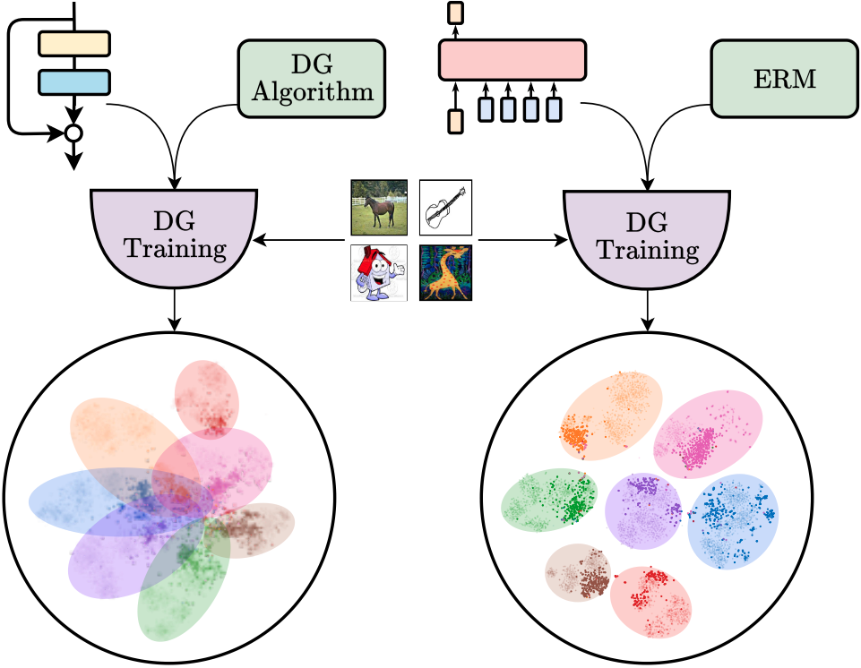

[](https://arxiv.org/abs/2209.01121)
[](https://www.gnu.org/licenses/gpl-3.0)

# Back-to-Bones
[Rediscovering the Role of Backbones in Domain Generalization](https://arxiv.org/abs/2209.01121)

<p>
    
</p>

*Our experimentation proves the importance of backbones in Domain Generalization. We find that novel architectures, such as transformed-based models, lead to a better representation of data, outperforming outdated backbones, such as ResNets,
and leaving marginal room for feature mapping improvement using DG algorithms.*

## Abstract
Domain Generalization (DG) studies the capability of a deep learning model to generalize to out-of-training distributions. In the last decade, literature has been massively filled with training methodologies that claim to obtain more abstract and robust data representations to tackle domain shifts. Recent research has provided a reproducible benchmark for DG, pointing out the effectiveness of naive empirical risk minimization (ERM) over existing algorithms. Nevertheless, researchers persist in using the same outdated feature extractors, and no attention has been given to the effects of different backbones yet. In this paper, we start back to the backbones proposing a comprehensive analysis of their intrinsic generalization capabilities, which so far have been ignored by the research community. We evaluate a wide variety of feature extractors, from standard residual solutions to transformer-based architectures, finding an evident linear correlation between large-scale single-domain classification accuracy and DG capability. Our extensive experimentation shows that by adopting competitive backbones in conjunction with effective data augmentation, plain ERM outperforms recent DG solutions and achieves state-of-the-art accuracy. Moreover, our additional qualitative studies reveal that novel backbones give more similar representations to same-class samples, separating different domains in the feature space. This boost in generalization capabilities leaves marginal room for DG algorithms. It suggests a new paradigm for investigating the problem, placing backbones in the spotlight and encouraging the development of consistent algorithms on top of them.

<p>
    
</p>

*DG accuracy achieved by tested backbones compared with their performance on ImageNet, with error bars. Regardless of different architectures and priors, we find a strong linear correlation between the two metrics (ρ = 0.921).*

## Description
This repository allows to train and test EdgeSRGAN on different Single Image Super-Resolution datasets using adversarial training combined with feature-wise Knowledge Distillation.

## Installation
We suggest to use a virtual environment (conda, venv, ...)
```
git clone git@github.com:PIC4SeR/Back-to-Bones.git
pip install -r requirements.txt
```

## Usage
### Configuration
To set all the training/testing parameters modify the configuration file:
```
nano config.yaml
```

### Training
Run the following command to train EdgeSRGAN on DIV2K:
```
python main.py
```

### Test
Run the following command to test EdgeSRGAN on all the included SISR test datasets:
```
sh test.sh
```

### Weights
Pretrained weights are available at [this link](https://drive.google.com/drive/folders/1E21iZ2apadpS--zh8PHRCM4DVuIKdOOJ?usp=sharing).

* `edgesrgan.h5`: float32 TF weights
* `edgesrgan.tflite`: float16 TFLite model for inference on CPU
* `edgesrgan_int8.tflite`: int8 TFLite model for inference on Coral EdgeTPU

## Results
<p>
    
    <em>Baselines comparison of different backbones for DG. We report the average accuracy over three runs and the associated standard deviation for each model. We include the results achieved by <span style="font-variant:small-caps;">DomainBed</span> with ResNet50 for reference. The models
marked with * are pretrained on Imagenet21K instead of ImageNet1K. The rightmost column indicates the accuracy of the networks on ImageNet1K.</em>
</p>


## Acknowledgments
This repository is intended for research scopes. If you use it for your research, please cite our paper using the following BibTeX:
```
@article{angarano2022back,
  title={Back-to-bones: Rediscovering the Role of Backbones in Domain Generalization},
  author={Angarano, Simone and Martini, Mauro and Salvetti, Francesco and Mazzia, Vittorio and Chiaberge, Marcello},
  journal={arXiv preprint arXiv:2209.01121},
  year={2022}}
```
We would like to thank the Interdepartmental Center for Service Robotics [PIC4SeR](https://pic4ser.polito.it), Politecnico di Torino.
